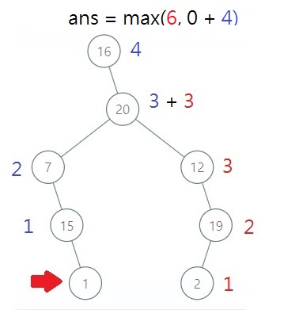

2385. Amount of Time for Binary Tree to Be Infected  

解題邏輯:  
使用 DFS 方式找出 Binary tree 每個節點最深的深度，搜尋過程中找到目標節點的話，使用一個變數記錄感染過程中，經過了多少個節點，再加上另一邊的深度，因此就能找出感染整棵樹所需要的時間。  
以下圖為例:  
  
感染從節點 1 開始。  
從節點 1 開始回推到節點 20 經過了 3 個節點，因此記錄感染過程等於 3 (程式碼用變數名稱 node 來記錄從感染源到樹根經過的節點數量)。  
節點 20 的右邊節點深度為 3，因此可以得知從感染源 1 經過節點 20 至節點 2，需要感染 6 次。  

  
最後計算根節點 16 時，目前已知最少需要感染 6 次，然而從感染源到根節點 16 需要感染 4 次，並且根節點沒有另一邊需要感染，最後執行 max(6,0+4) 找最大值就是答案了。  

<pre>
測試資料:
[16,null,20,7,12,null,15,null,19,null,1,2]
1
[1,5,3,null,4,10,6,9,2]
3
[1,2,null]
1
[1,2,3,4,5,6,7,8,9,10,11,12,13,14,15]
5
[1,2,3,4,5,6,7,8,9,10,11,12,null,null,15,16,null,null,null,20,null,null,23,24]
9
[1,null,2,null,3,null,4,null,5]
2
[16,null,20,7,12,null,15,null,19,null,1,2]
1
</pre>
